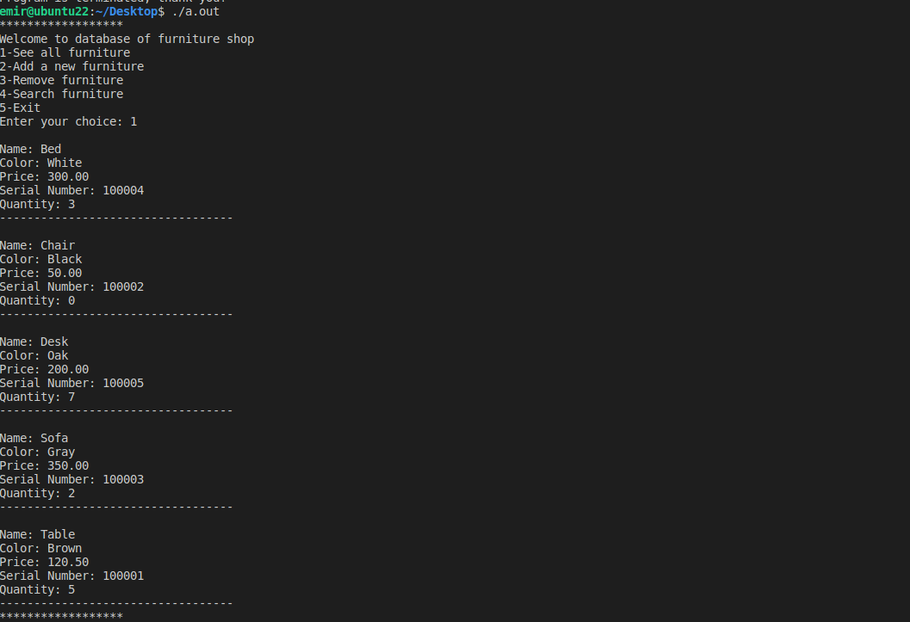
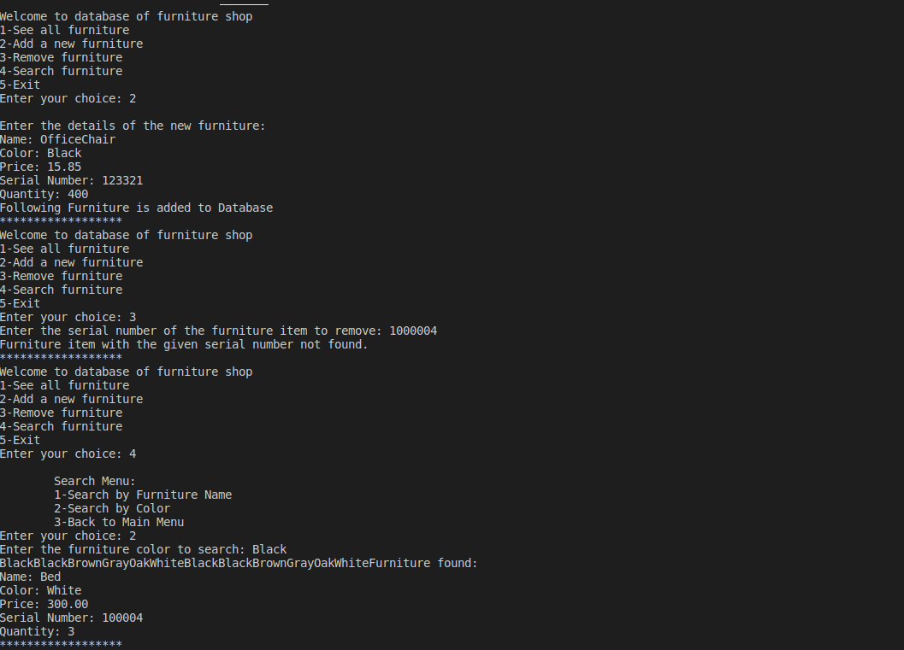
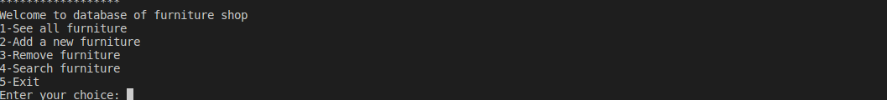

# CSE108 - Lab 9: Furniture Inventory System with Search

This lab involves developing a C program that simulates a furniture shop's inventory management system. The program interacts with a `furniture_database.txt` file to store and retrieve furniture item details. It features a menu-driven interface for managing inventory and includes search functionalities.

## Program Structure and Features

The program is implemented in `main.c` and utilizes a custom `Furniture` struct to manage inventory data.

### `Furniture` Struct

The `Furniture` struct is defined to encapsulate the properties of each furniture item:
*   `name` (char array)
*   `color` (char array)
*   `price` (double)
*   `serialNumber` (int, 6 digits)
*   `quantity` (int)

### Main Program Flow

The `main` function orchestrates the program's execution:
*   Initializes an array of `Furniture` structs and an `itemCount` to track the number of items.
*   Calls `loadDatabase` at startup to load existing inventory data from `furniture_database.txt`.
*   Presents an interactive menu in a loop, offering the following options:
    1.  **See all furniture:** Displays all items currently in the inventory.
    2.  **Add a new furniture:** Allows the user to input details for a new item.
    3.  **Remove furniture:** Removes an item based on its serial number.
    4.  **Search furniture:** Accesses a sub-menu for search operations.
    5.  **Exit:** Terminates the program, saving all current changes to the database file.

### Core Functions

*   **`loadDatabase(Furniture items[], int* itemCount)`:** Reads furniture data from `furniture_database.txt`, tokenizes each line, and populates the `items` array. It includes custom utility functions (`f_cpy`, `f_rm_newline`) for string handling.
*   **`saveDatabase(const Furniture items[], int itemCount)`:** Writes the current state of the `items` array back to `furniture_database.txt`, overwriting previous content. This function is called upon program exit.
*   **`displayAllFurniture(const Furniture items[], int itemCount)`:** Iterates through the `items` array and prints the details of each furniture item in a user-friendly format.
*   **`addFurniture(Furniture items[], int* itemCount)`:** Prompts the user for new furniture details and adds the item to the `items` array.
*   **`removeFurniture(Furniture items[], int* itemCount)`:** Takes a serial number, finds the corresponding item, and removes it from the array by shifting subsequent elements.
*   **`searchMenu(const Furniture items[], int itemCount)`:** Provides a sub-menu for users to choose between searching by furniture name or by color.

### Search Functions (Recursive)

*   **`searchByName(const Furniture items[], int start, int end, const char* targetName)`:** Implements a recursive binary search to find furniture items by name.
    *   **Note:** For this binary search to function correctly, the `items` array needs to be sorted by name. The current implementation does not sort the array, which may lead to incorrect search results.
*   **`searchByColor(const Furniture items[], int start, int end, const char* targetColor, int itemnumber)`:** Implements a recursive binary search to find furniture items by color.
    *   **Note:** Similar to `searchByName`, this function relies on a sorted array. While it attempts to sort a temporary array of colors using `alphabeticalOrder`, this sorting does not maintain the association with the original `Furniture` items, making the retrieval of correct furniture details problematic.

### Utility Functions

*   **`alphabeticalOrder(char words[][20], int count)`:** A helper function used to sort an array of strings alphabetically.
*   **`f_cpy(char *dest, char *source)`:** Custom string copy function.
*   **`f_rm_newline(char *str)`:** Custom function to remove newline characters from a string.

## Learning Objectives

*   Designing and implementing data structures (`struct`) for complex data.
*   Performing file I/O operations (`fopen`, `fclose`, `fgets`, `strtok`, `sscanf`, `fprintf`) for persistent data storage.
*   Developing menu-driven applications with interactive user interfaces.
*   Implementing array manipulation techniques (add, remove, display).
*   Understanding and attempting recursive search algorithms (binary search).
*   Recognizing the importance of data sorting for efficient search algorithms.

## How to Compile and Run

1.  **Navigate to the source directory:**
    ```bash
    cd CSE108/lab09/src
    ```

2.  **Compile the source code:**
    ```bash
    gcc -o main main.c
    ```

3.  **Run the executable:**
    ```bash
    ./main
    ```

## Database File

The program uses `furniture_database.txt` to store and retrieve furniture data. An example of this file is provided in the `src` directory.

## Output Example





[Details](./lab9.pdf)
