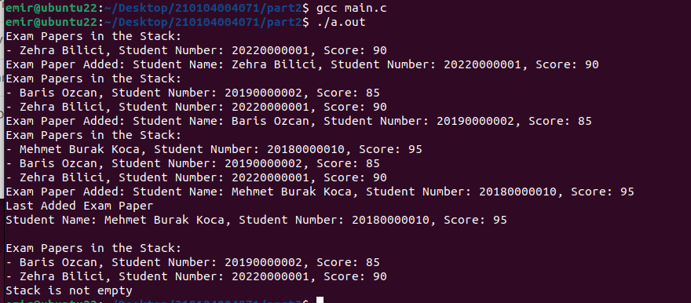

# CSE108 - Lab 11: Linked List Implementations (FIFO Queue & LIFO Stack)

This lab focuses on implementing fundamental data structures, specifically a FIFO (First-In-First-Out) queue and a LIFO (Last-In-First-Out) stack, using singly linked lists in C. The lab emphasizes dynamic memory allocation and prohibits the use of built-in library data structures for linked list management.

## Program Structure and Features

The lab is divided into two distinct parts, each implemented in its own `main.c` file within separate directories.

### Part 1: FIFO (First-In-First-Out) Queue Implementation

*   **Functionality:** This part simulates a food ordering system for a restaurant, managing orders in a FIFO queue. It allows for enqueuing new orders, dequeuing the oldest order, displaying all current orders, and updating details of an existing order.
*   **`Order` Struct:** Defines the structure for an order, including `customer_name`, `orderID`, `items`, `order_time`, and a `next` pointer to link orders in the list.
*   **Key Functions:**
    *   **`enqueue(Order* queue, ...)`:** Adds a new order to the end of the linked list (queue). Dynamically allocates memory for the new order node.
    *   **`dequeue(Order* queue)`:** Removes the order at the front of the linked list (the oldest order). Frees the memory of the dequeued node.
    *   **`display(Order* queue)`:** Traverses the linked list from head to tail and prints the details of each order.
    *   **`updateOrder(Order* queue, int orderID, char* newItems)`:** Searches for an order by its `orderID` and updates its `items` field if found.
*   **Memory Management:** All linked list nodes are dynamically allocated using `malloc` and deallocated using `free` to prevent memory leaks.

### Part 2: LIFO (Last-In-First-Out) Stack Implementation

*   **Functionality:** This part implements a system for managing student exam papers in a LIFO stack. It supports pushing new exam papers onto the stack, popping the most recently added paper, and checking if the stack is empty.
*   **`ExamPaper` Struct:** Defines the structure for an exam paper, including `studentName`, `studentNumber`, `score`, and a `next` pointer for linking papers in the stack.
    *   **Note:** The `studentName` field is a `char*`. While functional, in a production environment, it would be safer to allocate memory for the string within the `push` function and copy the `studentName` to prevent issues with dangling pointers if the source string is a local variable.
*   **Key Functions:**
    *   **`push(ExamPaper* stack, ...)`:** Adds a new exam paper to the top (beginning) of the linked list (stack). Dynamically allocates memory for the new paper node.
    *   **`pop(ExamPaper* stack)`:** Removes the top exam paper from the stack. Prints the details of the popped paper and frees its memory.
    *   **`isEmpty(ExamPaper* stack)`:** Returns `true` if the stack is empty, `false` otherwise.
    *   **`display(ExamPaper* stack)`:** Traverses the linked list and prints the details of each exam paper.
    *   **Note:** The `display` function modifies the `stack` pointer passed to it. To avoid altering the original stack pointer in the calling function, it should ideally take a `const ExamPaper* stack` or operate on a local copy of the pointer.
*   **Memory Management:** All linked list nodes are dynamically allocated using `malloc` and deallocated using `free`.

## Learning Objectives

*   Understanding the concepts of FIFO queues and LIFO stacks.
*   Implementing these data structures from scratch using singly linked lists.
*   Mastering dynamic memory allocation (`malloc`, `free`) for linked list nodes.
*   Developing functions for common linked list operations (insertion, deletion, traversal, updating).
*   Handling pointers effectively in C for complex data structures.

## How to Compile and Run

Each part is implemented in its own `main.c` file within its respective directory.

### For Part 1:

1.  **Navigate to the Part 1 source directory:**
    ```bash
    cd CSE108/lab11/src/part1
    ```

2.  **Compile the source code:**
    ```bash
    gcc -o main main.c
    ```

3.  **Run the executable:**
    ```bash
    ./main
    ```

### For Part 2:

1.  **Navigate to the Part 2 source directory:**
    ```bash
    cd CSE108/lab11/src/part2
    ```

2.  **Compile the source code:**
    ```bash
    gcc -o main main.c
    ```

3.  **Run the executable:**
    ```bash
    ./main
    ```

## Output Examples

### Part 1 Output Example


### Part 2 Output Example



[Details](./lab11.pdf)
