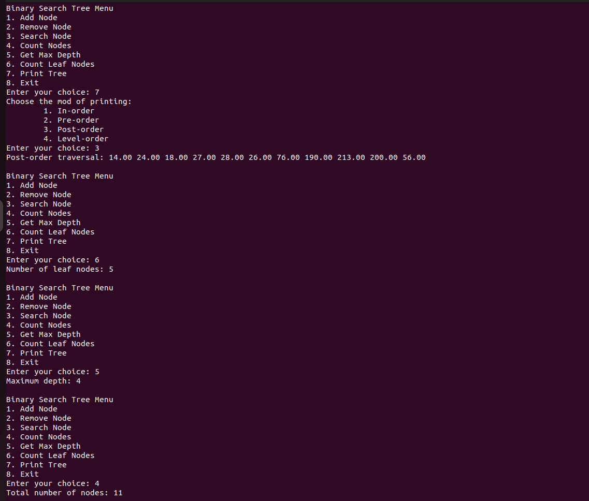
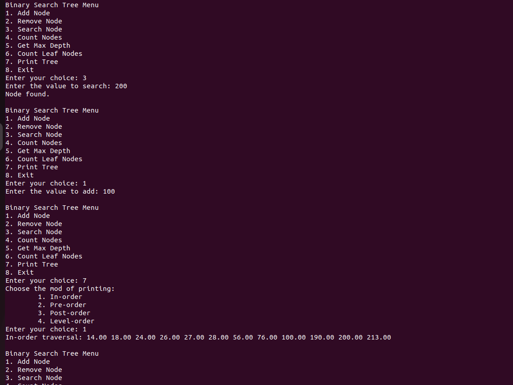
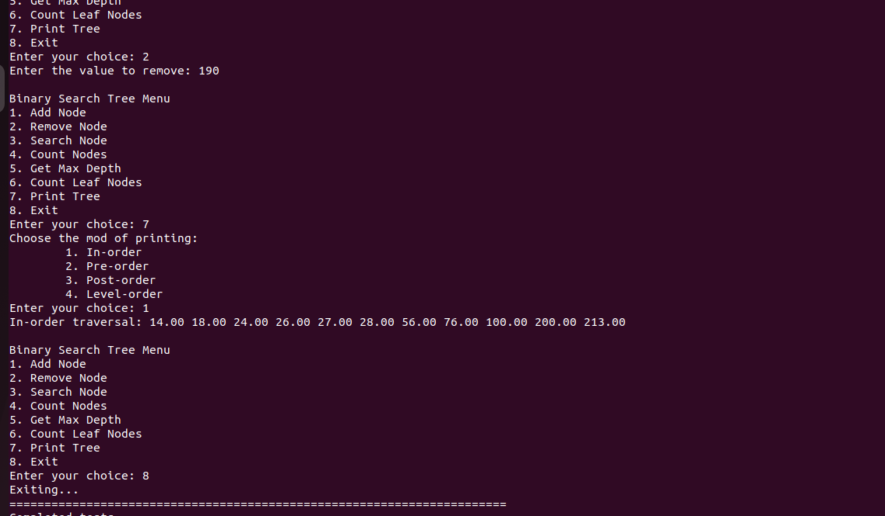

# CSE108 - Lab #13: Binary Search Tree Implementation

## Description

This project involves the implementation of a Binary Search Tree (BST) in C. The program reads a list of integers from a text file, constructs a BST, and provides a menu-driven interface for various tree operations, such as adding, removing, and searching for nodes, as well as calculating tree statistics.

## Program Structure and Features

The program is modularized into a library (`util.h`, `util.c`) that contains the BST logic and a `main.c` file that provides the user interface.

*   **Data Structures:**
    *   **`struct Node`:** Represents a node in the BST, containing a `double` value and pointers to its left and right children (`LeftNode`, `RightNode`).
    *   **`struct BST`:** Represents the entire tree, containing a pointer to the `root` node.

*   **Core Functionality (Implemented in `util.c`):**
    *   **`generateBST`:** Reads integers from `input.txt` and constructs the initial BST. The first integer becomes the root, and subsequent integers are inserted based on BST rules.
    *   **`addNode` / `insertNode`:** Adds a new node with a given value to the tree, maintaining the BST property.
    *   **`removeNode` / `deleteNode`:** Removes a node with a given value, handling cases for nodes with zero, one, or two children.
    *   **`searchNode`:** Recursively searches for a node with a specific value.
    *   **`countNodes`:** Returns the total number of nodes in the tree.
    *   **`getMaxDepth`:** Calculates the maximum depth (or height) of the tree.
    *   **`countLeafNodes`:** Counts the number of nodes that have no children.
    *   **`printTree`:** Provides a sub-menu to print the tree's nodes in different traversal orders (In-order, Pre-order, Post-order).

*   **User Interface (Implemented in `main.c`):**
    *   A `do-while` loop presents a menu with options to call the various BST functions.
    *   It handles user input and displays the results of the operations.

## Learning Objectives

*   Implementing a Binary Search Tree from scratch in C.
*   Using structs and pointers to create complex, dynamic data structures.
*   Modularizing code into a reusable library (`.h` and `.c` files).
*   Performing file I/O to populate the data structure.
*   Implementing fundamental tree algorithms:
    *   Insertion, deletion, and searching.
    *   Tree traversal (In-order, Pre-order, Post-order).
    *   Calculating tree properties like node count, depth, and leaf count.
*   Managing memory with `malloc` and `free`.

## How to Compile and Run

1.  **Navigate to the source directory:**
    ```bash
    cd CSE108/lab13/src
    ```

2.  **Compile the source code using the provided makefile:**
    ```bash
    make
    ```

3.  **Run the executable:**
    ```bash
    ./main
    ```

## Output Example

Here are examples of the program's output from various menu options:






[Details](./lab13.pdf)
