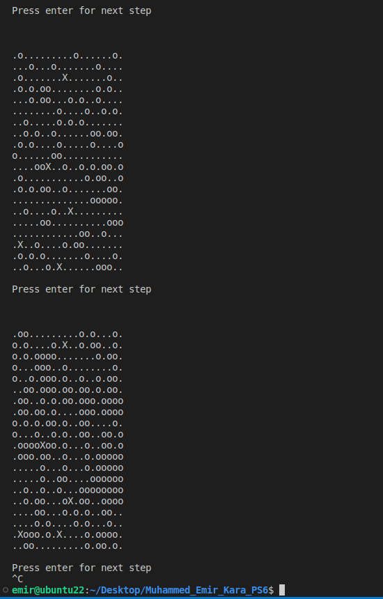

# CSE241 - Problem Solving #6: Predator-Prey Simulation

## Instructions

The goal for this programming project is to create a simple 2D predator-prey simulation. In this simulation the prey are ants and the predators are doodlebugs. These critters live in a world composed of a 20x20 grid of cells. Only one critter may occupy a cell at a time. The grid is enclosed, so a critter is not allowed to move off the edges of the world. Time is simulated in time steps. Each critter performs some action every time step.The ants behave according to the following model:

- **Move**. Every time step, randomly try to move up, down, left or right. If the neighboring cell in the selected direction is occupied or would move the ant off the grid, then the ant stays in the current cell.
- **Breed**. If an ant survives for three time steps, then at the end of the time step (i.e. after moving) the ant will breed. This is simulated by creating a new ant in an adjacent (up, down, left, or right) cell that is empty. If there is no empty cell available then no breeding occurs. Once an offspring is produced an ant cannot produce an offspring until three more time steps have elapsed.

The doodlebugs behave according to the following model:

- **Move**. Every time step, if there is an adjacent ant (up, down, left, or right) then the doodlebug will move to that cell and eat the ant. Otherwise the doodlebug moves according to the same rules as the ant. Note that a doodlebug cannot eat other doodlebugs.
- **Breed**. If a doodlebug survives for eight time steps, then at the end of the time step it will spawn off a new doodlebug in the same manner as the ant.
- **Starve**. If a doodlebug has not eaten an ant within the last three time steps, then at the end of the third time step it will starve and die. The doodlebug should then be removed from the grid of cells.

During one turn, all the doodlebugs should move before the ants.

Write a program to implement this simulation and draw the world using ASCII characters of "o" for an ant and "X" for a doodlebug. Create a class named Organism that encapsulates basic data common to both ants and doodlebugs. This class should have a virtual function named move that is defined in the derived classes of Ant and Doodlebug. You may need additional data structures to keep track of which critters have moved.

Initialize the world with 5 doodlebugs and 100 ants. After each time step prompt the user to press enter to move to the next time step. You should see a cyclical pattern between the population of predators and prey, although random perturbations may lead to the elimination of one or both species.

## Description
This project is a C++ implementation of a 2D predator-prey simulation. The simulation involves two types of organisms: Ants (prey) and Doodlebugs (predators), living in a 20x20 grid-based world. The simulation proceeds in time steps, where each organism performs an action according to a set of rules.

## Program Structure and Features

The simulation is built around a few core classes:
- **`World`**: Manages the 20x20 grid and the organisms within it. It handles the simulation steps and displays the world state.
- **`Organism`**: An abstract base class that defines the common properties and behaviors of all organisms, such as movement and breeding. It includes virtual functions for `move`, `breed`, and `starve`.
- **`Ant`**: A concrete class derived from `Organism`. Ants move randomly and breed every three time steps.
- **`Doodlebug`**: A concrete class derived from `Organism`. Doodlebugs hunt for adjacent Ants. If no Ant is nearby, they move randomly. They breed every eight time steps and starve if they haven't eaten an Ant in three time steps.

The simulation starts with 100 Ants and 5 Doodlebugs placed randomly on the grid. The user can advance the simulation one step at a time by pressing Enter.

### Rules of the World
- Only one organism can occupy a cell at a time.
- Organisms cannot move off the grid.
- Doodlebugs move before Ants in each time step.

## Learning Objectives
- Object-Oriented Programming (OOP) principles, including inheritance, polymorphism, and virtual functions.
- Dynamic memory management in C++.
- Simulating complex systems with interacting components.
- Basic input/output and control flow.

## How to Compile and Run

To compile and run the simulation:
```bash
g++ q1.cpp -o q1
./q1
```

## Output


