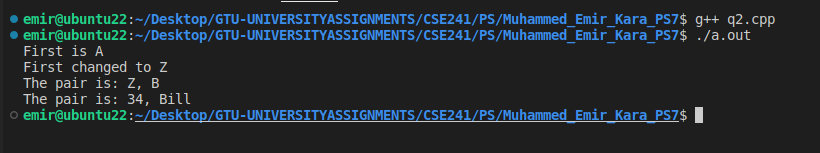

# CSE241 - Problem Solving #7: Template-based Set and Pair Classes

## Instructions

### Q1
Write a template-based class that implements a set of items. The class should allow the user to:

a. Add a new item to the set
b. Get the number of items in the set
c. Get a pointer to a dynamically created array containing each item in the set. The caller of this function is responsible for de-allocating the memory.

Test your class by creating sets of different data types (e.g. integers, strings, etc.)

### Q2
Write a Pair class (similar to Display 16.4) so that the pair of items can be different data types. Write a main function that tests the class with pairs of different data types.

## Description
This project consists of two C++ programs that demonstrate the use of templates to create generic classes. The first program (`q1.cpp`) implements a `Set` class, and the second (`q2.cpp`) implements a `Pair` class. Both classes are template-based, allowing them to be used with various data types.

## Program Structure and Features

### `q1.cpp` - Generic Set Class
This program defines a `Set` class that can store a collection of unique items of any data type. Key features include:
- **Template-based**: The class is defined using a template, allowing it to work with `int`, `string`, or any other data type.
- **`add(T newItem)`**: Adds a new item to the set, ensuring that no duplicates are added.
- **`getSize()`**: Returns the number of items in the set.
- **`getArray()`**: Returns a dynamically created array containing all the items in the set. The caller is responsible for deallocating the memory.

The `main` function tests the `Set` class by creating sets of integers and strings, adding elements, and printing their contents.

### `q2.cpp` - Generic Pair Class
This program defines a `Pair` class that can store a pair of items, where each item can be of a different data type. Key features include:
- **Multi-type Template**: The class uses two template parameters (`T` and `V`) to allow for pairs of different data types (e.g., `Pair<int, string>`).
- **Constructors**: A constructor to initialize the pair with two values.
- **Accessors and Mutators**: Methods to get and set the first and second elements of the pair.

The `main` function demonstrates the flexibility of the `Pair` class by creating pairs of different data type combinations.

## Learning Objectives
- Understanding and implementing template-based classes in C++.
- Creating generic data structures that can work with multiple data types.
- Dynamic memory allocation and management.
- Using the `std::vector` container as a basis for a custom data structure.

## How to Compile and Run

To compile and run `q1.cpp`:
```bash
g++ q1.cpp -o q1
./q1
```

To compile and run `q2.cpp`:
```bash
g++ q2.cpp -o q2
./q2
```

## Output

### q1.cpp


### q2.cpp
